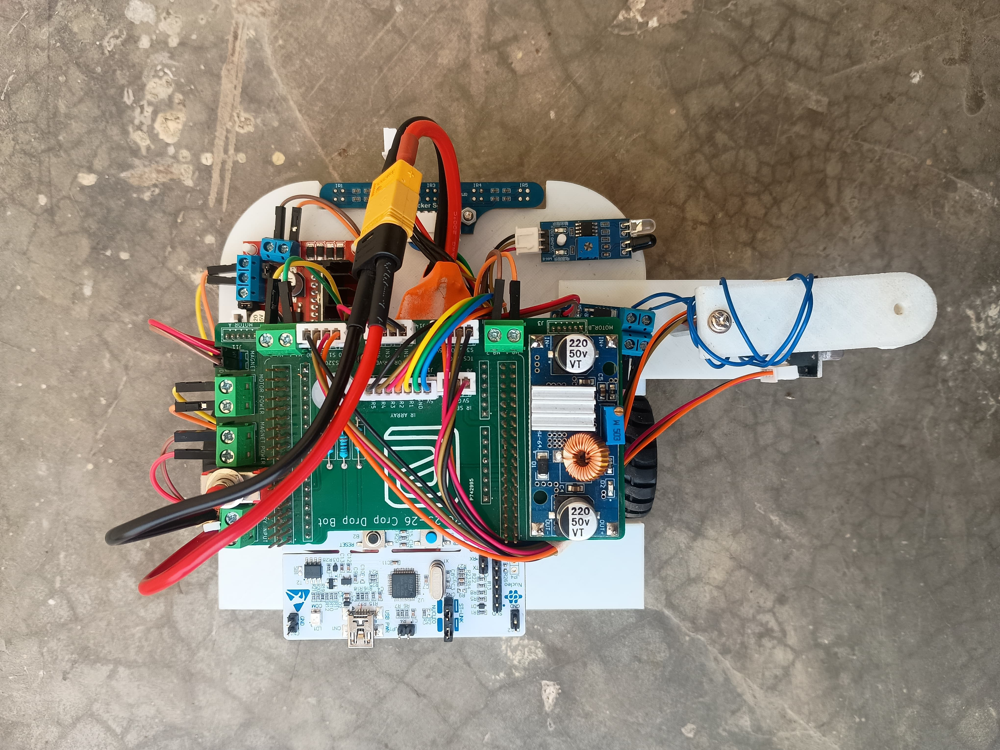
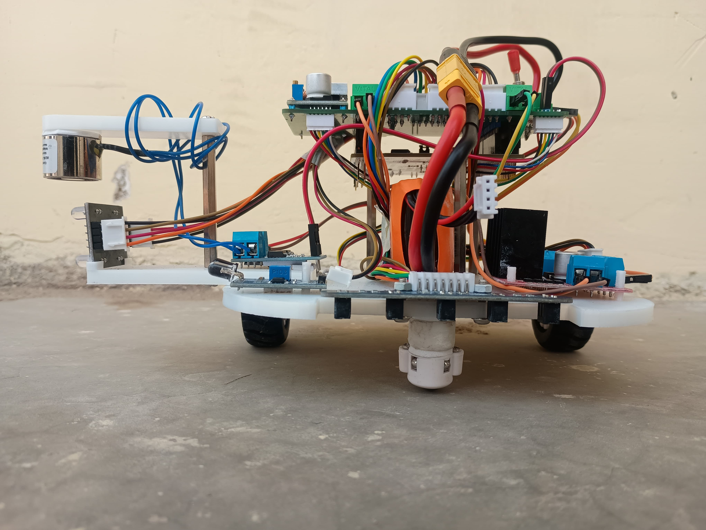
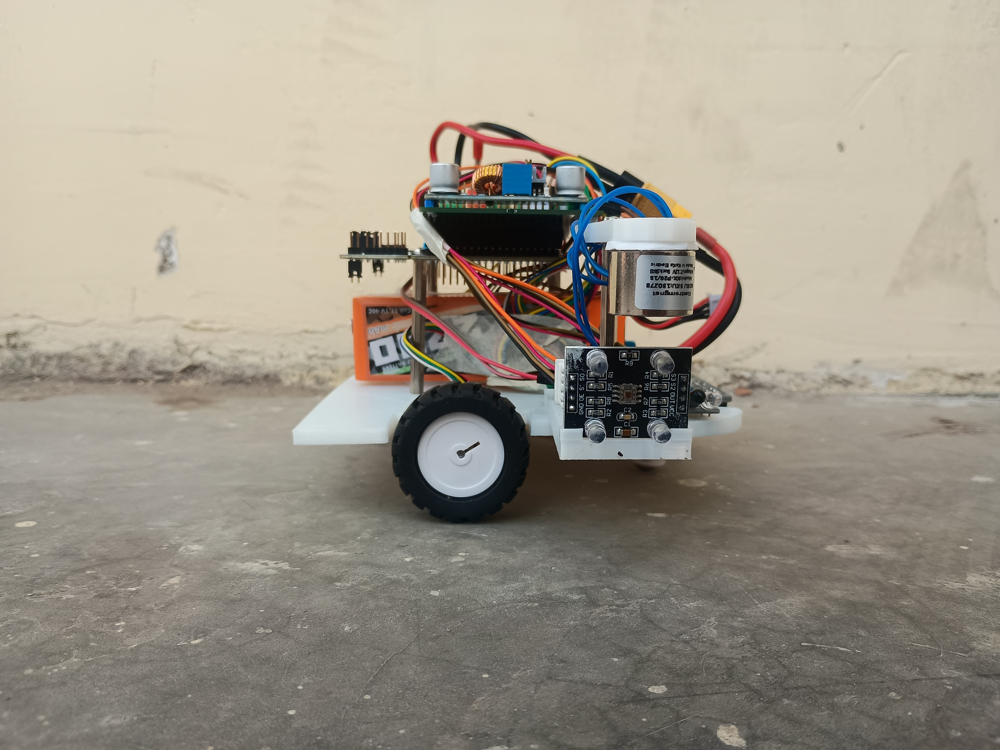
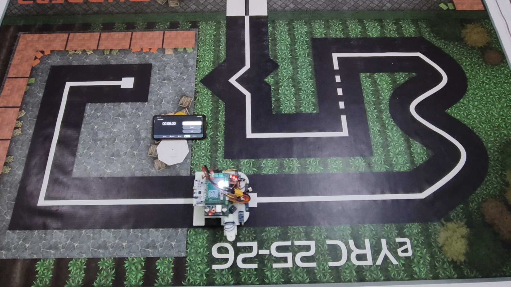
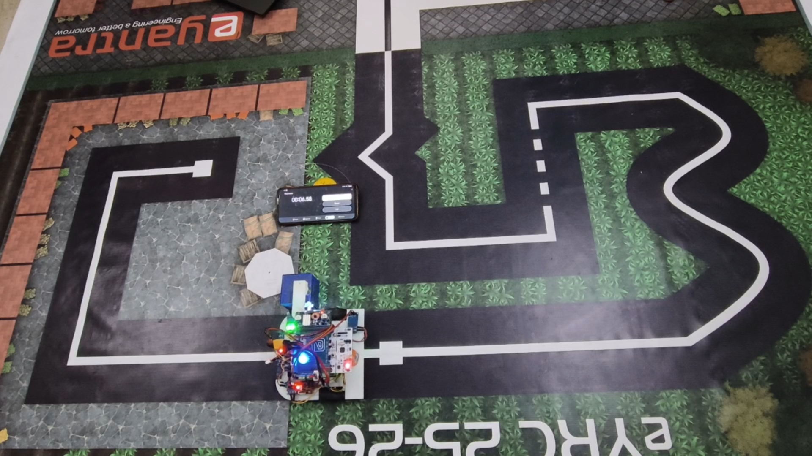

# 🌾 Crop Drop Bot — eYantra Robotics Competition 2025
### Team CB#3084 | Tasks 1 → 5

A fully autonomous line-following robot that detects coloured crop boxes,
navigates a grid arena via PID and Q-Learning, and physically picks up and
drops boxes at the correct destination zones.

---

## Table of Contents
- [Project Overview](#project-overview)
- [Robot Photos](#robot-photos)
- [Repository Structure](#repository-structure)
- [Task 1 — Environment Setup & Algorithm Design](#task-1)
- [Task 2 — Simulation: Color Detection, Navigation & Drop Logic](#task-2)
- [Task 3 — Hardware Assembly](#task-3)
- [Task 4 — Real Arena: Black Line Following](#task-4)
- [Task 5 — Dual Line Following (Black + White)](#task-5)
- [Key Technical Challenges & How I Solved Them](#challenges)
- [Hardware Stack](#hardware-stack)
- [Software Stack](#software-stack)
- [PID Tuning Reference](#pid-tuning)
- [How to Run](#how-to-run)
- [Demo Videos](#demo-videos)
- [Results](#results)

---

## Project Overview

The **Crop Drop Bot** is an autonomous robot designed for the eYantra 2025 competition.
It follows both black and white lines on a printed arena, reads the colour of cargo boxes
using an onboard colour sensor, communicates with a backend server, and deposits each
box at the matching colour-coded destination zone — all without human intervention.

The project progressed through five tasks, moving from pure simulation in CoppeliaSim
to a fully assembled physical robot running on a real printed arena. Tasks 1–4 were
completed successfully. The team was eliminated at Task 5 due to a hardware constraint:
no single IR sensor mounting height could produce readings that distinguished both
black and white lines reliably at the same time on the physical arena.

---

## Robot Photos

| Top view | Front view | Side view |
|:---:|:---:|:---:|
|  |  |  |

---

## Repository Structure

```
crop_drop/
├── CB_3084_Task_1B_rl/          # Task 1B/1C — Q-Learning implementation
│   ├── Qlearning.py             #   Core Q-table training loop
│   ├── Train.py                 #   Training entry point
│   ├── Test.py                  #   Policy evaluation
│   ├── Connector.py             #   CoppeliaSim socket bridge
│   ├── wrapper/                 #   Environment wrapper
│   ├── q_table.pkl              #   Trained Q-table (binary)
│   └── result.json              #   Training metrics
│
├── crop_drop_task_2/            # Task 2 — Simulation navigation
│   ├── crop.txt                 #   Dev notes & sensor logs
│   ├── ubuntu 24-20251107T131635Z-1-001/   # PID implementation (Task 2A)
│   └── ubuntu 24-20251111T121329Z-1-001/   # RL algorithm using Q-Learning (Task 2B)
│
├── crop_drop_task_3/            # Task 3 — PCB & mechanical
│   ├── CB#3084_3A.zip           #   Onshape / 3D model files
│   ├── CB_PCB_schematics.pdf    #   PCB schematic
│   ├── CB_Gerber/               #   Gerber files for fabrication
│   ├── STEP files/              #   3D printable parts
│   ├── stm ioc files/           #   STM32 IOC config
│   └── Task3_arena_testing.ttt  #   CoppeliaSim scene
│
├── crop_drop_task_4/            # Task 4 — Black line, real arena
│   ├── Task4a_PID/              #   PID controller source
│   ├── Task4b_RL/               #   RL policy deployment
│   └── Verify_task4a/           #   Verification scripts
│
├── crop_drop_task_5/            # Task 5 — Dual line mode
│   └── Task5a_PID/              #   Combined black+white PID
│
├── top_view.png                 # Arena top-view reference photo
├── front_view.png               # Robot front view
├── side_view.png                # Robot side view
├── crop drop.txt                # CoppeliaSim sensor log (Task 2 development notes)
├── Crop Drop Testing.txt        # Real hardware build & PID tuning log (Task 3/4)
└── .gitignore
```

---

## Task 1 — Environment Setup & Algorithm Design <a name="task-1"></a>

### Task 1A — Ubuntu Setup
The competition required Ubuntu 24 as the working environment.

**What I did:**
- Installed Ubuntu 24 alongside Windows (dual-boot)
- Set up CoppeliaSim, Python 3, and all required simulation libraries
- Configured the socket communication bridge between Python and CoppeliaSim (`Connector.py`)

### Task 1B — PID Line Following
Implemented a classic 5-sensor weighted PID controller.

**Error calculation (weighted position):**
```
Sensor weights: [-2, -1, 0, 1, 2]
error = Σ(weight[i] × sensor[i]) / Σ(sensor[i])
```

**Tuned parameters (simulation):**
```
Kp = 1.45,  Ki = 0.03,  Kd = 0.01
base_speed = 4.0
```

### Task 1C — Reinforcement Learning (Q-Learning)
Implemented a tabular Q-Learning agent as an alternative to PID.

**Key design decisions:**
- State: discretised sensor reading pattern
- Actions: `[hard_left, left, straight, right, hard_right]`
- Reward: +10 on-line, −5 off-line, −1 per step
- Trained policy serialised to `q_table.pkl` and loaded at inference time

---

## Task 2 — Simulation: Color Detection, Navigation & Drop Logic <a name="task-2"></a>

This was the most algorithmically complex task, involving colour detection,
junction navigation, and precise drop placement — all inside CoppeliaSim.

### 2A — Color Detection

**Problem:** CoppeliaSim's rendering pipeline returns non-standard raw RGB values
that don't map intuitively to actual colours.

**Raw values observed (before normalisation):**

| Color | Raw R | Raw G | Raw B |
|-------|-------|-------|-------|
| Blue  | 0.098 | 0.000 | 0.000 |
| Red   | 0.188 | 0.569 | 0.000 |
| Green | 0.188 | 0.000 | 0.569 |

**Fix — dominance mapping:** Rather than comparing absolute values,
I normalised the three channels and classified by whichever channel was dominant.
This made detection robust to the non-linear rendering pipeline.

### 2A — Junction Detection

The 5-sensor array gives distinct signatures at junctions vs. straight lines.

**Straight line:**
```
[0.83, 0.83, 0.03, 0.83, 0.83]   → outer 4 high, centre low
```

**Junction (T or cross):**
```
[0.83, 0.83, 0.03, 0.83, 0.83]   → multiple high readings fade
[0.83, 0.44, 0.03, 0.46, 0.83]   → then inner sensors drop
[0.62, 0.03, 0.03, 0.32, 0.63]   → transition zone
[0.37, 0.03, 0.03, 0.05, 0.03]   → robot centred on junction
```

**Condition to detect junction:**
```C
if(isBlack(c) && !junction && boxPicked) {
    printf("Node is detected\n");
    SLEEP(10);
    set_motor(c,0,0);
    
    printf("color of Box: %c\n",colorDetected);
    char dir = chooseDirection(colorDetected);
    printf("Turn Direction: %c \n",dir);
}
```

### 2A — Destination Zone Detection

Instead of using the colour sensor on the floor (unreliable at low angle),
I used the box color to detect the direction as its mapped for each color there sperate direction in which i need to move.

```C
char chooseDirection(char boxColor) {
    char dir;
    if(boxColor == 'R') {
        dir = 'L';
    }
    else if(boxColor == 'G') {
        dir = 'R';   
    }
    else if(boxColor == 'B') {
        dir = 'F';
    }
    return dir;   
}
```

### 2B — Dual Line Following + Full Path

**White line (inverted logic):**
White line = high reading on centre sensor, low on outer sensors.
```
[0.09, 0.09, 0.83, 0.09, 0.09]   ← centre sensor high = ON white line
```
Error computed by inverting weights so PID steers toward the high centre value.

**Black line (normal logic):**
Black line = low reading on the sensor directly above it, high on surroundings.
```
[0.83, 0.03, 0.83, 0.83, 0.83]   ← sensor 2 low = ON black line
```

**Line-type classifier:**
```cpp
bool isBlack(SocketClient* c) {
    float ir1 = c->line_sensors[0];  // left_corner sensor
    float ir2 = c->line_sensors[1];  // left sensor
    float ir3 = c->line_sensors[2];  // middle sensor (center)
    float ir4 = c->line_sensors[3];  // right sensor
    float ir5 = c->line_sensors[4];

    if(ir1 < 0.4 && ir2 < 0.4 && ir3 < 0.4 && ir4 < 0.4 && ir5 < 0.4) {
        return true;
    }
    return false;
}
```

**Corner conflict fix — `corner_duration` counter:**

At corners, the sensor array reads a mix of black+high values that momentarily
satisfy both black and white conditions. Adding a persistence counter (`corner_duration = 25`)
means the robot only switches line-type classification after 25 consecutive
matching frames, preventing thrashing.

```cpp
corner_duration = 25;  // frames the corner pattern must persist before acting
```

**PID re-tuning after box pickup:**

With the box loaded, the robot's centre of mass shifts and the effective turning
radius changes. Corners failed without a separate loaded-state PID set:

```
Unloaded:  Kp = 1.45, Ki = 0.03, Kd = 0.01
Loaded:    Kp = 1.10, Ki = 0.02, Kd = 0.05   (more damping, less aggression)
```

---

## Task 3 — Hardware Assembly <a name="task-3"></a>

### Mechanical
The chassis was split into three separate 3D-printed parts to make assembly and
sensor positioning adjustable:
- **Base** — motor mounts, wheel wells, main body
- **Colour sensor mount** — angled bracket to hold the sensor at correct reading height
- **Magnet holder** — gripper mechanism for picking up boxes

STEP files are in `crop_drop_task_3/STEP files/`.

### Electronics
- Microcontroller: STM32 Nucleo (configured via `.ioc` files)
- Motor drivers wired to the STM32 PWM outputs
- 5× IR reflectance sensors on underside bracket
- Colour sensor positioned to read boxes at pick-up height
- PCB designed in KiCad — Gerber files in `CB_Gerber/`

### Wiring reference
See `CB_PCB_schematics.pdf` for full schematic.

### How to read IR sensor output (hardware debug)
```bash
# Connect the Nucleo board via USB, then:
ls /dev/ttyACM*                              # find the port
putty -fn "Monospace 12"                     # launch PuTTY with readable font
# In PuTTY: Connection Type = Serial, Speed = 115200, Serial line = /dev/ttyACM0
```

### Bring-up: IR sensor ADC → reflectance conversion

Raw ADC values: maximum on white, minimum on black.
First step was converting to reflectance percentage (0 = black, 100 = white).

**Problem encountered:** the conversion was not producing middle values —
readings jumped directly between 0 and 100 with nothing in between.
This was traced to missing normalisation in the ADC-to-percentage mapping
and was fixed before PID tuning began.

### Real hardware PID tuning — the actual journey

The position error uses weighted sensors `{-2, -1, 0, 1, 2}` multiplied by 10
to give enough steering authority (raw weights alone were too small).

**Stage 1 — find critical Kp (Ki = Kd = 0):**

| Kp | Observed behaviour |
|---|---|
| 15 | Slight oscillation — borderline usable |
| 15–16 | ⭐ Critical point — oscillates but follows |
| 18 | Follows straight, won't turn at corners |
| 32 | Still won't turn |
| 46 | Very small turn — not usable |

Initial tuning stalled here because the position weights `{-2,-1,0,1,2}` were
too small. Multiplying by 10 gave enough correction range to actually steer.

**Stage 2 — add Kd to kill oscillation:**
```
Kd ≈ Kp × 0.2  →  Kd = 15 × 0.2 = 3
```

**Stage 3 — alignment issue:**
The bot followed straight paths but was physically offset — centred over sensor 4
instead of sensor 3. Two options considered:
- Individual sensor calibration *(correct long-term fix)*
- Setpoint offset `setPoint = -2.0f` *(used as temporary workaround)*

**Stage 4 — corner turning problem:**

At `base_speed = 80` the PID correction alone couldn't steer the robot through
corners. A `turn_boost` and `speed_scale` were added but caused jerky motion and
occasional line-loss.

The real fix was **dynamic speed** — reduce wheel speed proportionally to error
magnitude so the robot naturally slows at corners:

```c
dynamic_speed = base_speed - (k_speed * abs(error));
// At corners: error ≈ 1.5–2.0
// k_speed = 3  →  speed reduced by 4.5–6.0 at corners
```

**Stage 5 — dt term was missing from PID:**

The integral and derivative terms were not being scaled by `dt` (time between
updates). After adding it:
- At `Kp = 1, Ki = Kd = 0, base_speed = 120`: robot drifts
- At `Ki = 16`: robot starts turning — confirmed dt fix was working
- Behaviour from Ki = 16 to Ki = 50 was consistent (only zigzag amplitude changed)
  because at speed 120 the maximum PID correction was already at its steering limit

**Stage 6 — smooth speed ramp-up:**

Setting `turn_boost` and `speed_scale` as global variables caused the motors to
snap to the reduced corner speed on the very first corner and never recover.
A gradual speed ramp mechanism was needed — increase speed continuously rather
than jumping — similar to how a real vehicle accelerates.

**Final working parameters (Task 3 verification):**
```
Kp = 19,  Ki = 1,  Kd = 2
base_speed = 80,  min_speed = 10
speed_scale = 0.8,  turn_boost = 1.5,  k_speed = 3
Path accuracy: ~80%
```

---

## Task 4 — Real Arena: Black Line Following <a name="task-4"></a>

First full run on the **physically printed** competition arena, carrying forward
the hardware PID foundation from Task 3.

**Key differences encountered vs Task 3 bench testing:**
- Real arena ink has softer edges than the test track — junction thresholds loosened
- Reflective paper surface adds noise — moving-average smoothing added to sensor reads
- Motors don't respond linearly at low PWM — deadband compensation added

**PID re-tuned for full arena speed:**
```
Kp = 1.80,  Ki = 0.02,  Kd = 0.08
base_speed = 3.5  (reduced from 80 PWM units — arena safety margin)
```

Both PID (Task 4A) and RL policy from Task 1C (Task 4B) were deployed and compared.
PID outperformed RL on the physical arena because the Q-table was trained on
clean simulation sensor readings that don't match the noise profile of real hardware.

---

## Task 5 — Dual Line Following (Black + White) ⚠️ Elimination Point <a name="task-5"></a>

The Task 5 arena mixes both black and white line segments on the same track.
The robot must autonomously detect which type it is currently on and flip PID
error polarity accordingly.

**The software approach worked in simulation:**
```python
def detect_line_type(sensors):
    centre = sensors[2]
    outer_avg = (sensors[0] + sensors[4]) / 2
    if centre > 0.7 and outer_avg < 0.2:
        return "white"       # bright centre, dark edges
    elif centre < 0.2 and outer_avg > 0.7:
        return "black"       # dark centre, bright edges
    else:
        return "unknown"     # transition — hold last known type
```

### ❌ Why we were eliminated

**Root cause: IR sensor mounting height.**

In simulation both line types produced clean, separable readings because the
virtual sensors have no physical constraints. On the real robot, the 5 IR
sensors are fixed at one physical height above the floor.

The problem is that the threshold values that make white-line detection work
conflict with the threshold values needed for black-line detection at the same
mounting height:

| Sensor height | White line centre reading | Black line low reading | Conflict? |
|---|---|---|---|
| Too low | ~0.83 (saturated, clear) | ~0.03 (clear) | ✅ No conflict — but robot physically scrapes floor at turns |
| Optimal for black | ~0.55 (detectable) | ~0.03 (clear) | ⚠️ White-line readings drop into ambiguous range |
| Optimal for white | ~0.83 (clear) | ~0.35 (too high) | ⚠️ Black line no longer reads low enough to distinguish |

Every height we tried either made white-line detection unreliable or pushed the
black-line low reading up into the range where the classifier got confused during
transitions. The `corner_duration` filter that worked in Task 2 simulation was not
enough to mask the ambiguity on the physical track.

**What we tried:**
- Adjusting sensor array height in 1 mm increments (3 mm → 8 mm from floor)
- Recalibrating thresholds for each height separately
- Using a longer `corner_duration` window to filter transition noise
- Running at lower speed to give the sensor more time to settle

None of these resolved the fundamental overlap in reading ranges between the two
line types at a single fixed height.

**What would have fixed it:**
- An adjustable sensor arm that could tilt the array slightly (changes the
  effective angle, not just height) — small tilt changes white vs black contrast
  independently
- Using two separate sensor arrays at different heights, one tuned for each line
- A sensor with higher dynamic range so the two reading bands don't overlap

---

## Key Technical Challenges & How I Solved Them <a name="challenges"></a>

| Challenge | Root Cause | Solution |
|---|---|---|
| Wrong colour detection in sim | CoppeliaSim non-standard rendering pipeline | Channel-dominance normalisation instead of absolute RGB thresholds |
| IR sensor ADC not returning middle values | Missing normalisation in ADC-to-reflectance conversion | Fixed mapping so values span full 0–100 range |
| PID couldn't steer at corners (Kp up to 46) | Position weights `{-2,-1,0,1,2}` too small for enough correction range | Multiplied weights by 10 to give sufficient steering authority |
| Robot physically offset — followed line on sensor 4 not sensor 3 | Mechanical misalignment of sensor bracket | Temporary: `setPoint = -2.0f` offset. Proper fix: per-sensor calibration |
| Jerky motion at corners with `turn_boost` | Global speed variables snapped to corner values and never recovered | Replaced with `dynamic_speed = base_speed − (k_speed × |error|)` so speed reduces smoothly with error magnitude |
| Missing `dt` in PID made integral/derivative wrong | PID update loop ran at variable rate with no time scaling | Added `dt` term; re-tuned from scratch after fix |
| Junction over-detection | Transition frames look like junctions | Added consecutive-frame counter before triggering junction logic |
| Corner thrashing (black vs white) | Mixed sensor readings at corners | `corner_duration = 25` persistence filter |
| Robot can't turn after box pickup | Shifted CoM changes dynamics | Separate loaded/unloaded PID parameter sets |
| Floor colour undetectable by colour sensor | Sensor angle too shallow for flat surface | Switched to flat-value detection using line sensor array average |
| RL underperforms on real arena | Sim sensor noise doesn't match real hardware | Kept RL as fallback; deployed PID for competition runs |
| Black line junction readings change after pickup | Box blocks one sensor slightly | Re-calibrated junction threshold: all sensors `< 0.30` instead of `< 0.10` |
| ❌ **No single sensor height works for both line types** (Task 5 — **unsolved**) | Fixed sensor array height creates overlapping reading ranges for black and white lines on the physical robot | Tried height adjustments (3–8 mm), threshold recalibration, longer persistence window, lower speed — none fully resolved the overlap. Would need an angled/adjustable sensor arm or a dual-array setup |

---

## Hardware Stack <a name="hardware-stack"></a>

| Component | Part |
|---|---|
| Microcontroller | STM32 |
| Motors | DC gear motors × 2 |
| Line sensors | IR reflectance array × 5 |
| Colour sensor | TCS3200 (or equivalent) |
| Gripper | Servo-actuated custom 3D-printed |
| Power | LiPo battery + regulator |
| Chassis | Custom 3D-printed (STEP files included) |

---

## Software Stack <a name="software-stack"></a>

| Layer | Technology |
|---|---|
| Simulation | CoppeliaSim EDU |
| Robot–sim bridge | Python socket (`Connector.py`) |
| Control algorithm | PID + Q-Learning (Python) |
| Firmware | STM32 HAL (C) |
| Training | Custom Q-Learning (`Qlearning.py`) |
| Build system | Make / STM32CubeIDE |

---

## PID Tuning Reference <a name="pid-tuning"></a>

```
Context                 Kp      Ki      Kd      base_speed
─────────────────────────────────────────────────────────
Sim — white line        1.45    0.03    0.01    4.0
Sim — black line        1.45    0.03    0.01    4.0
Sim — loaded (black)    1.10    0.02    0.05    3.5
Real arena (Task 4)     1.80    0.02    0.08    3.5
Real arena — loaded     1.30    0.02    0.10    3.0
```

---

## How to Run <a name="how-to-run"></a>

### Simulation (Tasks 1–2)

```bash
# 1. Open the scene in CoppeliaSim
#    File → Open → Task3_arena_testing_modified.ttt

# 2. Install Python dependencies
pip install -r requirements.txt

# 3. Train Q-Learning (Task 1C)
cd CB_3084_Task_1B_rl
python Train.py

# 4. Run PID controller
python Test.py --mode pid

# 5. Run RL controller
python Test.py --mode rl
```

### Real Hardware (Tasks 4–5)
float compute_line_conf(float *r)
{
    float s = 0.0f;
    for (int i = 0; i < NUM_SENSORS; i++) s += r[i];
    return s;
}
```bash
# Flash firmware via STM32CubeIDE
# Open project in crop_drop_task_4/Task4a_PID
# Build → Flash to board
# Place robot on arena start position → power on
```

---

## Demo Videos

> Click a thumbnail to open and play the video directly on GitHub.

### Task 4 — Black line following on real arena

[](https://youtu.be/oO3rsXFNNNE)

### Task 4 —  Box pickup run

[](https://youtu.be/H0FVPsiAQus)

---

## Results

| Task | Status | Notes |
|---|---|---|
| 1A — Ubuntu setup | ✅ Complete | Dual-boot, CoppeliaSim configured |
| 1B — PID sim | ✅ Complete | Stable line following achieved |
| 1C — Q-Learning | ✅ Complete | Policy converges after ~500 episodes |
| 2A — Colour + nav | ✅ Complete | Junction stop + colour-directed routing |
| 2B — Dual line + pick/drop | ✅ Complete | Both line types, corner fix applied |
| 3 — Hardware assembly | ✅ Complete | Robot assembled and functional |
| 4 — Real arena black line | ✅ Complete | PID outperforms RL on real hardware |
| 5 — Dual line real arena | ❌ Eliminated | IR sensor reading ranges for black and white lines overlap at every tested mounting height; no single fixed position produced clean discrimination on the physical robot |

---

> **Competition:** eYantra Robotics Competition 2025
> **Team ID:** CB#3084
> **Theme:** Crop Drop Bot